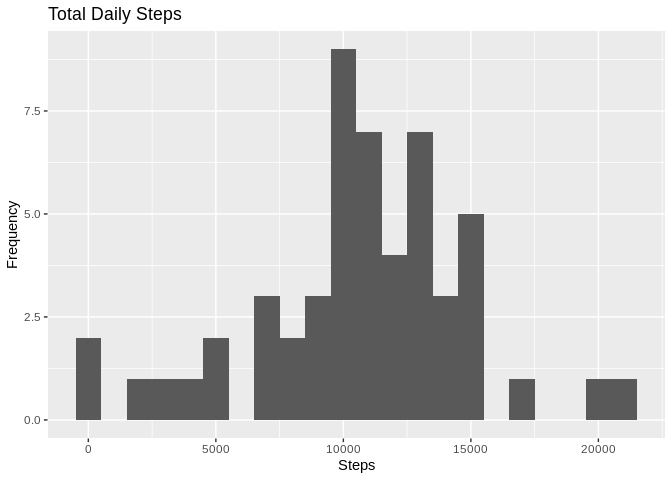
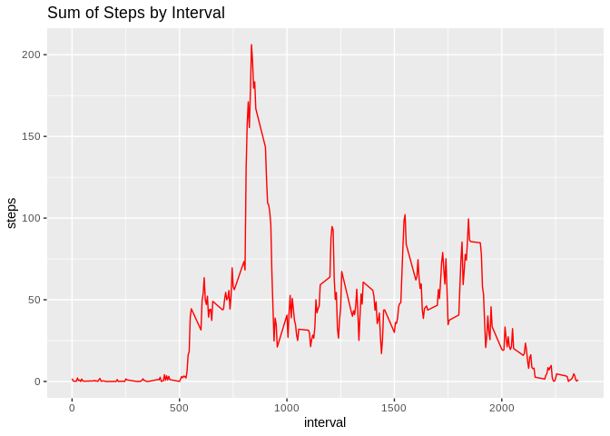
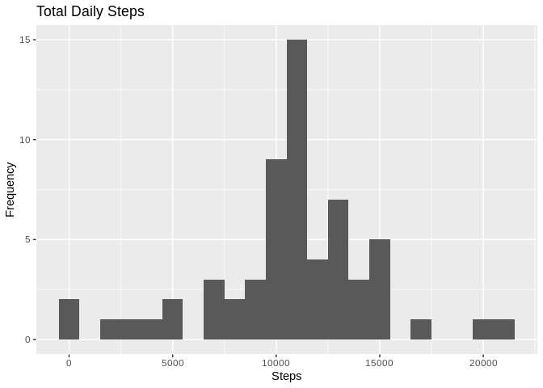
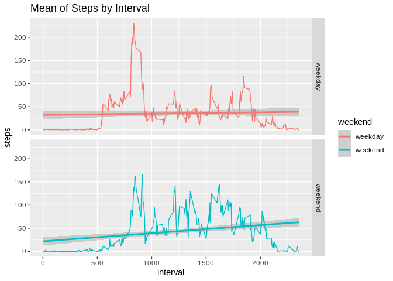

## Loading and preprocessing the data


```r
library('ggplot2')
unzip("./activity.zip")
data <- read.csv("./activity.csv")
head(data)
```

```
##   steps       date interval
## 1    NA 2012-10-01        0
## 2    NA 2012-10-01        5
## 3    NA 2012-10-01       10
## 4    NA 2012-10-01       15
## 5    NA 2012-10-01       20
## 6    NA 2012-10-01       25
```

```r
stepIndex <- is.na(data$steps)
data$date <- as.Date(as.character(data$date))
```

## What is mean total number of steps taken per day?

###Calculate the total number of steps taken per day

```r
temp <- aggregate(x = list(totalsteps = data$steps), by=list(date = data$date), FUN = sum)
head(temp)
```

```
##         date totalsteps
## 1 2012-10-01         NA
## 2 2012-10-02        126
## 3 2012-10-03      11352
## 4 2012-10-04      12116
## 5 2012-10-05      13294
## 6 2012-10-06      15420
```

###Make a histogram of the total number of steps taken each day

```r
ggplot(temp, aes(totalsteps))+geom_histogram(binwidth=1000)+labs(title = "Total Daily Steps", x = "Steps", y = "Frequency")
```

```
## Warning: Removed 8 rows containing non-finite values (stat_bin).
```

<!-- -->

###Calculate and report the mean and median of the total number of steps taken per day

```r
mean(temp$totalsteps, na.rm=TRUE)
```

```
## [1] 10766.19
```

```r
median(temp$totalsteps, na.rm=TRUE)
```

```
## [1] 10765
```
## What is the average daily activity pattern?

### Make a time series plot of the 5-minute interval (x-axis) and the average number of steps taken, averaged across all days (y-axis)


```r
nonNAData <- data[!stepIndex,]
meanDataByInterval <- aggregate(list(steps = nonNAData$steps), by = list(interval = nonNAData$interval), mean)
```

```r
ggplot(meanDataByInterval, aes(x = interval, y=steps)) +
labs(title = "Sum of Steps by Interval", x = "interval", y = "steps")+
geom_line(color="red") 
```

<!-- -->

###Which 5-minute interval, on average across all the days in the dataset, contains the maximum number of steps?


```r
maxInterval <- meanDataByInterval[which.max(meanDataByInterval$steps),]
maxInterval
```

```
##     interval    steps
## 104      835 206.1698
```

## Imputing missing values

###Devise a strategy for filling in all of the missing values in the dataset.

Strategy: use meanDataByInterval which contains means of that 5 minutes interval.

###Calculate and report the total number of missing values in the dataset (i.e. the total number of rows with NAs)


```r
sum(stepIndex)
```

```
## [1] 2304
```

### Create a new dataset that is equal to the original dataset but with the missing data filled in.

```r
newdata <- data
newdata[stepIndex,]$steps = meanDataByInterval$steps
head(newdata)
```

```
##       steps       date interval
## 1 1.7169811 2012-10-01        0
## 2 0.3396226 2012-10-01        5
## 3 0.1320755 2012-10-01       10
## 4 0.1509434 2012-10-01       15
## 5 0.0754717 2012-10-01       20
## 6 2.0943396 2012-10-01       25
```

### Make a histogram of the total number of steps taken each day and Calculate and report the mean and median total number of steps taken per day.


```r
temp2 <- aggregate(x = list(totalsteps = newdata$steps), by=list(date = newdata$date), FUN = sum)
ggplot(temp2, aes(totalsteps))+geom_histogram(binwidth=1000)+labs(title = "Total Daily Steps", x = "Steps", y = "Frequency")
```

<!-- -->

```r
mean(temp2$totalsteps)
```

```
## [1] 10766.19
```

```r
median(temp2$totalsteps)
```

```
## [1] 10766.19
```
###What is the impact of imputing missing data on the estimates of the total daily number of steps?
By using the mean of per interval in place of missing value, overall mean is same as previous part but median is slightly increse.

## Are there differences in activity patterns between weekdays and weekends?

```r
newdata$weekday <- weekdays(newdata$date)
newdata$weekend <- ifelse (newdata$weekday == "Saturday" | newdata$weekday == "Sunday", "weekend", "weekday")
head(newdata)
```

```
##       steps       date interval weekday weekend
## 1 1.7169811 2012-10-01        0  Monday weekday
## 2 0.3396226 2012-10-01        5  Monday weekday
## 3 0.1320755 2012-10-01       10  Monday weekday
## 4 0.1509434 2012-10-01       15  Monday weekday
## 5 0.0754717 2012-10-01       20  Monday weekday
## 6 2.0943396 2012-10-01       25  Monday weekday
```

```r
meanData3byInterval <- aggregate(list(steps=newdata$steps), by=list(weekend=newdata$weekend, interval=newdata$interval), mean)
ggplot(meanData3byInterval, aes(x = interval, y=steps, color=weekend)) +
geom_line() +
facet_grid(weekend ~ .) +
labs(title = "Mean of Steps by Interval", x = "interval", y = "steps")+
geom_smooth(method='lm')
```

<!-- -->

There seems to be variation in the beginning of the day during weekdays, likely due to workplace activities.
In weekends there is increasing nature with time interval
